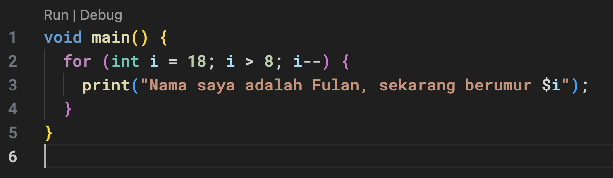
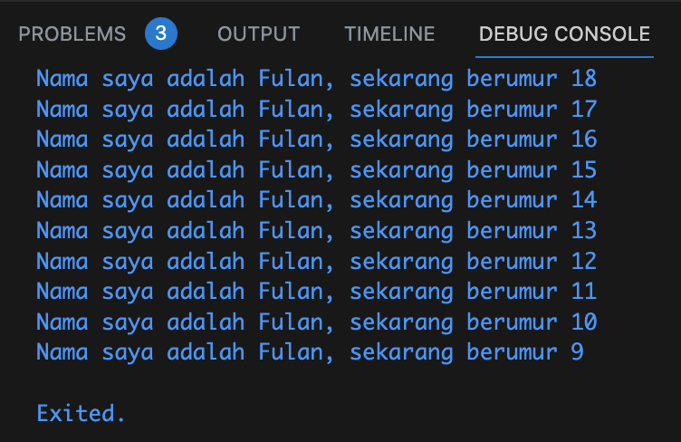

# Laporan Praktikum

<table>
  <tr>
    <th>Nama</th>
    <td>Tio Misbaqul Irawan</td>
  </tr>
  <tr>
    <th>NIM</th>
    <td>2141720003</td>
  </tr>
  <tr>
    <th>Proyek</th>
    <td>Variable dan Tipe Data</td>
  </tr>
</table>

## 1. Memodifikasi kode menjadi output yang diminta

### Code

### Output

## 2. Mengapa sangat penting untuk memahami bahasa pemrograman Dart sebelum kita menggunakan framework Flutter ? Jelaskan!

Karena Flutter menggunakan bahasa pemrograman Dart, sehingga kita harus memahami bahasa pemrograman Dart terlebih dahulu sebelum menggunakan framework Flutter.

## 3. Rangkumlah materi dari codelab ini menjadi poin-poin penting yang dapat Anda gunakan untuk membantu proses pengembangan aplikasi mobile menggunakan framework Flutter.

### 1. Bahasa Dart adalah Inti dari Framework Flutter:
Bahasa Dart digunakan sebagai bahasa inti dalam pengembangan aplikasi dengan Flutter.
Flutter membutuhkan bahasa modern seperti Dart untuk memberikan pengalaman terbaik kepada pengembang.

### 2. Mengapa Dart Dipilih untuk Flutter:
Dart dipilih karena tujuannya untuk menggabungkan kelebihan bahasa tingkat tinggi dengan fitur terbaru.
Dart dapat dikompilasi menjadi kode native untuk berbagai platform.
Dart memiliki alat yang produktif dan sistem garbage collection yang efisien.

### 3. Evolusi Dart:
Dart diluncurkan pada tahun 2011 dan mengalami perkembangan signifikan.
Dart awalnya fokus pada pengembangan web, tetapi kemudian berfokus pada pengembangan seluler, terutama dengan Flutter.
Dart menawarkan performa terbaik dan alat yang baik untuk proyek berskala besar.

### 4. Cara Eksekusi Kode Dart:
Kode Dart dapat dieksekusi melalui Dart VM (Just-In-Time atau Ahead-Of-Time) atau kompilasi menjadi JavaScript.
Dart VM mendukung JIT untuk debugging dan hot reload. Dart VM juga mendukung AOT untuk menghasilkan kode native untuk berbagai platform.

### 5. Struktur Dasar Bahasa Dart:
Dart memiliki struktur dasar yang mirip dengan banyak bahasa pemrograman lainnya.
Bahasa Dart adalah bahasa berorientasi objek dengan fitur seperti encapsulation, **inheritance**, **composition**, **abstraction**, dan **polymorphism**.
Operator dalam Dart digunakan sebagai method dengan sintaks khusus.
Dart mendukung operator aritmatika, increment/decrement, equality/relational, dan logical.

### 6. Main Function dalam Dart:
Function main() adalah entry point dalam setiap program Dart.
Dart VM mencari function main() untuk memulai eksekusi kode.
Tipe data yang dikembalikan oleh function perlu didefinisikan, dengan void menunjukkan bahwa tidak ada data yang dikembalikan.
Tanda kurung () menunjukkan parameter yang diterima oleh function (function main() tidak menerima parameter).

### 7. Function vs. Method:
Function berada di luar class, sedangkan method terikat pada turunan class dan memiliki referensi implisit ke instance class melalui this.