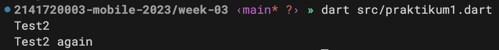
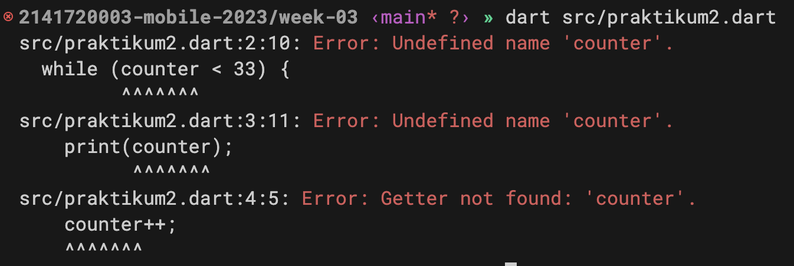
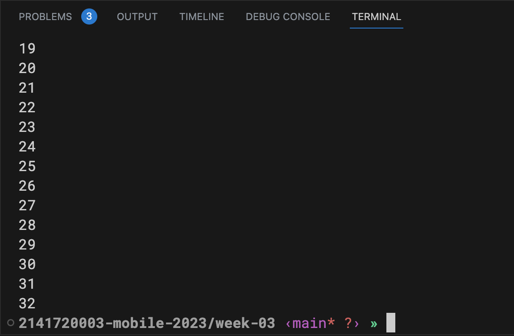
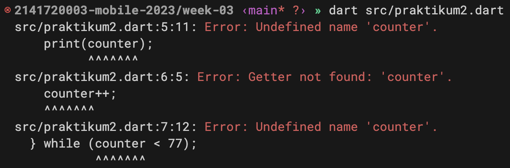
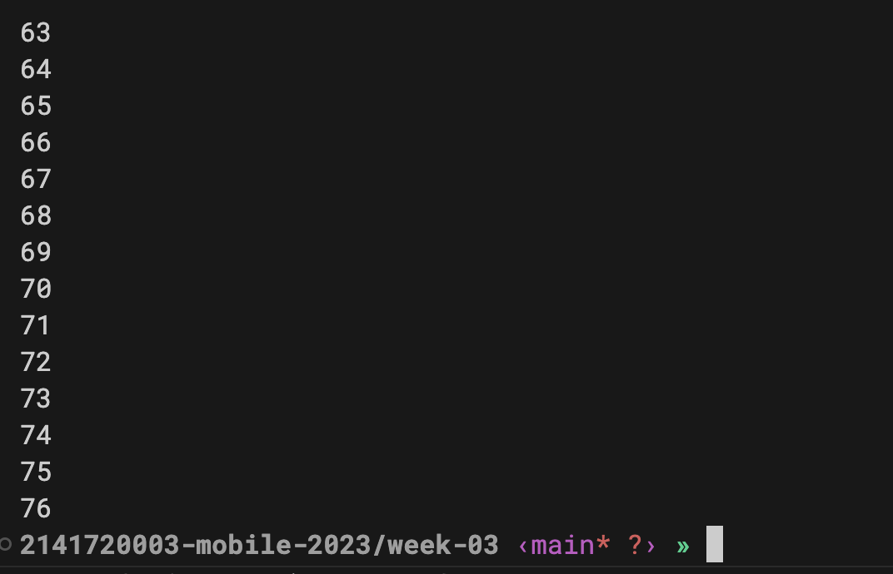
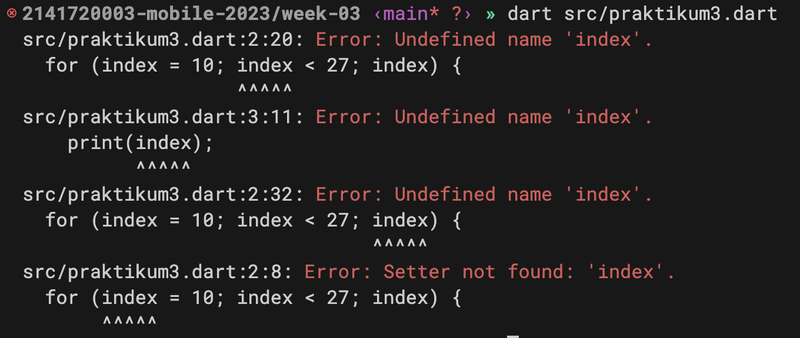
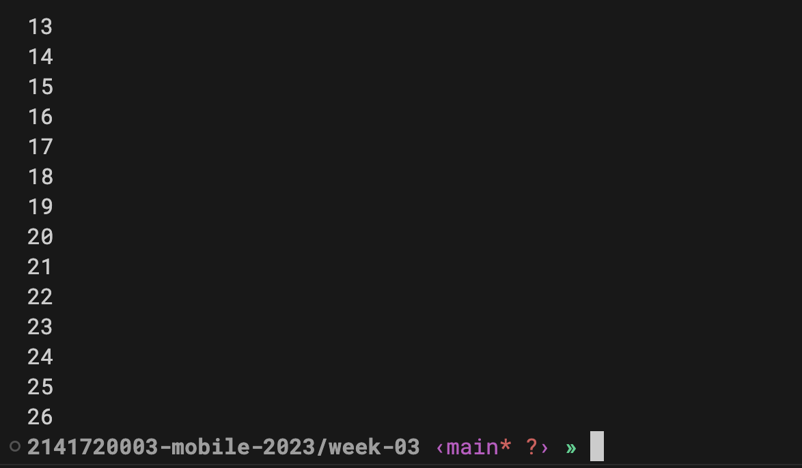
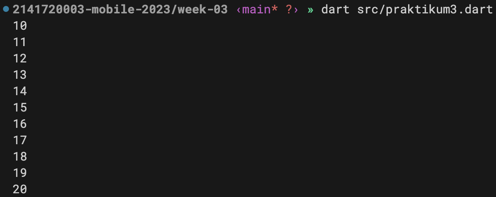
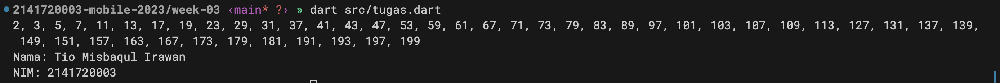

# Laporan Praktikum

<table>
  <tr>
    <th>Nama</th>
    <td>Tio Misbaqul Irawan</td>
  </tr>
  <tr>
    <th>NIM</th>
    <td>2141720003</td>
  </tr>
  <tr>
    <th>Proyek</th>
    <td>Mobile</td>
  </tr>
</table>

# Praktikum 1

## Langkah 1
```dart
void main() {
  String test = "test2";

  if (test == "test1") {
    print("Test1");
  } else if (test == "test2") {
    print("Test2");
  } else {
    print("Something else");
  }

  if (test == "test2") print("Test2 again");
}
```

## Langkah 2

1. Pada baris pertama, kita memiliki deklarasi fungsi main(). Fungsi main() biasanya merupakan titik awal eksekusi program dalam banyak bahasa pemrograman, termasuk Dart.

2. Pada baris kedua, kita mendeklarasikan sebuah variabel bernama test dan menginisialisasinya dengan nilai string "test2".

3. Kemudian, kita memiliki struktur kontrol kondisional if-else. Ini digunakan untuk memeriksa nilai variabel test dan mencetak pesan berdasarkan kondisi berikut:

   - Jika test sama dengan "test1", maka program akan mencetak "Test1".
   - Jika test sama dengan "test2", maka program akan mencetak "Test2".
   - Jika test tidak sama dengan "test1" atau "test2" (kondisi default), maka program akan mencetak "Something else".
  
4. Di baris terakhir, kita memiliki pernyataan if terpisah yang memeriksa apakah test sama dengan "test2" lagi. Jika ya, maka program akan mencetak "Test2 again".

Jadi, secara keseluruhan, kode ini melakukan pemeriksaan kondisi pada variabel test dan mencetak pesan berdasarkan nilai variabel tersebut. Hasil keluaran program akan tergantung pada nilai awal variabel test yang telah diinisialisasi, yaitu "test2". Karena itu, program akan mencetak "Test2" dan "Test2 again" karena kondisi kedua terpenuhi.

## Langkah 3

Hasil perbaikan kode:
```dart
String test2 = "true";
if (test2 == "true") {
  print("Kebenaran");
}
```

1. Nama variable diubah menjadi test2 agar tidak terjadi error karena nama variable test sudah digunakan sebelumnya.
2. Pada pengecekan `if(test)` diubah menjadi `if(test2 == "true")` agar sesuai dengan nilai yang diisikan pada variable test2. Ini karena variable test2 bertipe string, sehingga harus dibandingkan dengan string juga.

# Praktikum 2

## Langkah 1
```dart
void main() {
  while (counter < 33) {
    print(counter);
    counter++;
  }
}
```

## Langkah 2

Terjadi error karena variable counter belum dideklarasikan sebelumnya.

Perbaikan kode:
```dart
void main() {
  int counter = 0;

  while (counter < 33) {
    print(counter);
    counter++;
  }
}
```
Setelah dideklarasikan, maka program dapat berjalan dengan baik.


## Langkah 3
```dart
void main() {
  do {
    print(counter);
    counter++;
  } while (counter < 77);
}
```

Error karena variable counter belum dideklarasikan sebelumnya.



Perbaikan kode:
```dart
void main() {
  int counter = 0;

  do {
    print(counter);
    counter++;
  } while (counter < 77);
}
```

Setelah dideklarasikan, maka program dapat berjalan dengan baik.



# Praktikum 3

## Langkah 1
```dart
void main() {
  for (index = 10; index < 27; index) {
    print(index);
  }
}
```

## Langkah 2



Terjadi error karena variable index belum dideklarasikan sebelumnya dan operasi increment pada variable index tidak ada.

Solusinya adalah dengan mendeklarasikan variable index terlebih dahulu dengan cara menambahkan tipe data int sebelum nama variable. Kemudian, pada operasi increment, kita harus menambahkan `index++` agar variable index dapat terus bertambah.

```dart
void main() {
  for (int index = 10; index < 27; index++) {
    print(index);
  }
}
```

Setelah dideklarasikan, maka program dapat berjalan dengan baik.



## Langkah 3
```dart
void main() {
  for (int index = 10; index < 27; index++) {
    if (index == 21) {
      break;
    } else if (index > 1 || index < 7) {
      continue;
    }
    
    print(index);
  }
}
```
Pada kode ini, tidak terjadi error. Namun, output yang dihasilkan tidak sesuai dengan yang diharapkan. Ketika dijalankan, tidak ada output yang keluar, ini karena pada kondisi `else if(index > 1 || index < 7)` akan selalu terpenuhi, sehingga setiap iterasi akan melakukan continue dan tidak akan mencetak apapun. Solusinya adalah mengganti operator `||` menjadi `&&` agar hanya melakukan continue ketika index lebih dari 1 dan kurang dari 7.

```dart
void main() {
  for (int index = 10; index < 27; index++) {
    if (index == 21) {
      break;
    } else if (index > 1 && index < 7) {
      continue;
    }

    print(index);
  }
}
```

Maka, program dapat berjalan dengan baik.



# Tugas
```dart
void main() {
  List<int> primes = generatePrime(201);

  String primesString = primes.join(', ');
  
  print(primesString);
  print("Nama: Tio Misbaqul Irawan");
  print("NIM: 2141720003");
}

// Pembangkitan bilangan prima menggunakan Sieve of Eratosthenes
List<int> generatePrime(int max) {
  List<int> primes = [];
  List<bool> isPrime = List.filled(max, true);

  for (int i = 2; i < max; i++) {
    if (isPrime[i]) {
      primes.add(i);

      for (int j = i * i; j < max; j += i) {
        isPrime[j] = false;
      }
    }
  }

  return primes;
}
```

Output


### Penjelasan

1. Pertama, kita membuat fungsi `generatePrime` yang menerima parameter `max` yang bertipe int dan mengembalikan nilai List<int>. Fungsi ini digunakan untuk menghasilkan bilangan prima dari 2 sampai `max`. Fungsi ini menggunakan algoritma Sieve of Eratosthenes untuk menghasilkan bilangan prima.
2. Kemudian, kita membuat variabel `primes` yang bertipe List<int> untuk menampung bilangan prima yang dihasilkan oleh fungsi `generatePrime`.
3. Selanjutnya, kita membuat variabel `primesString` yang bertipe String untuk menampung bilangan prima yang dihasilkan oleh fungsi `generatePrime` dalam bentuk string.
4. Kemudian, kita mencetak `primesString` dan nama serta NIM.
