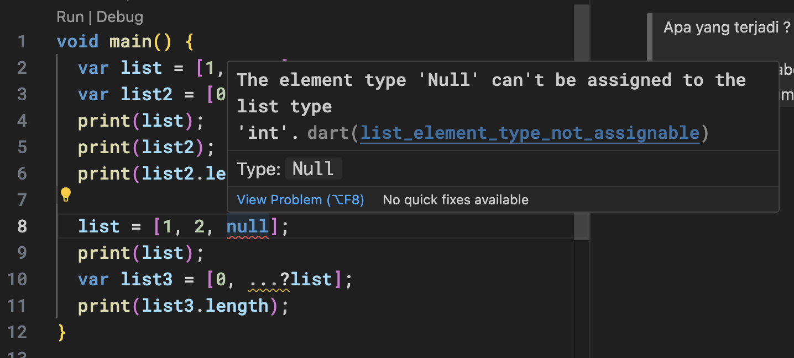

# Laporan Praktikum

<table>
  <tr>
    <th>Nama</th>
    <td>Tio Misbaqul Irawan</td>
  </tr>
  <tr>
    <th>NIM</th>
    <td>2141720003</td>
  </tr>
  <tr>
    <th>Proyek</th>
    <td>Mobile</td>
  </tr>
</table>

## Daftar Isi

- [Laporan Praktikum](#laporan-praktikum)
  - [Daftar Isi](#daftar-isi)
  - [Praktikum 1](#praktikum-1)
    - [Langkah 1](#langkah-1)
    - [Langkah 2](#langkah-2)
    - [Langkah 3](#langkah-3)
  - [Praktikum 2](#praktikum-2)
    - [Langkah 1](#langkah-1-1)
    - [Langkah 2](#langkah-2-1)
    - [Langkah 3](#langkah-3-1)
  - [Praktikum 3](#praktikum-3)
    - [Langkah 1](#langkah-1-2)
    - [Langkah 2](#langkah-2-2)
    - [Langkah 3](#langkah-3-2)
  - [Praktikum 4](#praktikum-4)
    - [Langkah 1](#langkah-1-3)
    - [Langkah 2](#langkah-2-3)
    - [Langkah 3](#langkah-3-3)
    - [Langkah 4](#langkah-4)
    - [Langkah 5](#langkah-5)
    - [Langkah 6](#langkah-6)
  - [Praktikum 5](#praktikum-5)
    - [Langkah 1](#langkah-1-4)
    - [Langkah 2](#langkah-2-4)
    - [Langkah 3](#langkah-3-4)
    - [Langkah 4](#langkah-4-1)
    - [Langkah 5](#langkah-5-1)
  - [Tugas Praktikum](#tugas-praktikum)

## Praktikum 1

### Langkah 1

```dart
void main() {
  var list = [1, 2, 3];
  assert(list.length == 3);
  assert(list[1] == 2);
  print(list.length);
  print(list[1]);

  list[1] = 1;
  assert(list[1] == 1);
  print(list[1]);
}
```

### Langkah 2

> Silakan coba eksekusi (Run) kode pada langkah 1 tersebut. Apa yang terjadi? Jelaskan!

Setelah dijalankan, maka akan muncul output seperti berikut:

```bash
$ dart src/praktikum1.dart
3
2
1
```
Ini terjadi karena pada baris ke-7, nilai dari index ke-1 pada list diubah menjadi 1. Sehingga, ketika dijalankan, maka nilai dari index ke-1 pada list akan menjadi 1.

### Langkah 3

> Ubah kode pada langkah 1 menjadi variabel final yang mempunyai index = 5 dengan default value = null. Isilah nama dan NIM Anda pada elemen index ke-1 dan ke-2. Lalu print dan capture hasilnya.
> 
> Apa yang terjadi ? Jika terjadi error, silakan perbaiki.

```dart
void main() {
  List<String?> list = List.filled(5, null);
  list[1] = 'Tio Misbaqul Irawan';
  list[2] = '2141720003';
  print(list);
}
```

Setelah dijalankan, maka akan muncul output seperti berikut:

```bash
$ dart src/praktikum1.dart
[null, Tio Misbaqul Irawan, 2141720003, null, null]
```

## Praktikum 2

### Langkah 1

> Ketik atau salin kode program berikut ke dalam fungsi main().

```dart
void main() {
  var halogens = {'fluorine', 'chlorine', 'bromine', 'iodine', 'astatine'};
  print(halogens);
}
```

### Langkah 2

> Silakan coba eksekusi (Run) kode pada langkah 1 tersebut. Apa yang terjadi? Jelaskan! Lalu perbaiki jika terjadi error.

Setelah dijalankan, maka akan muncul output seperti berikut:

```bash
$ dart src/praktikum2.dart
{fluorine, chlorine, bromine, iodine, astatine}
```

### Langkah 3

> Tambahkan kode program berikut, lalu coba eksekusi (Run) kode Anda.

```dart
var names1 = <String>{};
Set<String> names2 = {}; // This works, too.
var names3 = {}; // Creates a map, not a set.

print(names1);
print(names2);
print(names3);
```

> Apa yang terjadi ? Jika terjadi error, silakan perbaiki namun tetap menggunakan ketiga variabel tersebut. Tambahkan elemen nama dan NIM Anda pada kedua variabel Set tersebut dengan dua fungsi berbeda yaitu .add() dan .addAll(). Untuk variabel Map dihapus, nanti kita coba di praktikum selanjutnya.

Setelah dijalankan, maka akan muncul output seperti berikut:

```bash
$ dart src/praktikum2.dart
{}
{}
{}
```

Kemudian saya menambahkan kode untuk menambahkan elemen nama dan NIM pada variabel Set:

```dart
void main() {
  var names1 = <String>{};
  Set<String> names2 = {}; // This works, too.
  var names3 = {}; // Creates a map, not a set.

  names1.add('Tio Misbaqul Irawan');
  names2.addAll({'Tio Misbaqul Irawan', '2141720003'});

  print(names1);
  print(names2);
  print(names3);
}
```

Setelah dijalankan, maka akan muncul output seperti berikut:

```bash
$ dart src/praktikum2.dart
{Tio Misbaqul Irawan}
{Tio Misbaqul Irawan, 2141720003}
{}
```

## Praktikum 3

### Langkah 1

> Ketik atau salin kode program berikut ke dalam fungsi main().

```dart
void main() {
  var gifts = {
    // Key:    Value
    'first': 'partridge',
    'second': 'turtledoves',
    'fifth': 1
  };

  var nobleGases = {
    2: 'helium',
    10: 'neon',
    18: 2,
  };

  print(gifts);
  print(nobleGases);
}
```

### Langkah 2

> Silakan coba eksekusi (Run) kode pada langkah 1 tersebut. Apa yang terjadi? Jelaskan! Lalu perbaiki jika terjadi error.

Setelah dijalankan, maka akan muncul output seperti berikut:

```bash
$ dart src/praktikum3.dart
{first: partridge, second: turtledoves, fifth: 1}
{2: helium, 10: neon, 18: 2}
```

### Langkah 3

> Tambahkan kode program berikut, lalu coba eksekusi (Run) kode Anda.

```dart
var mhs1 = Map<String, String>();
gifts['first'] = 'partridge';
gifts['second'] = 'turtledoves';
gifts['fifth'] = 'golden rings';

var mhs2 = Map<int, String>();
nobleGases[2] = 'helium';
nobleGases[10] = 'neon';
nobleGases[18] = 'argon';
```

> Apa yang terjadi ? Jika terjadi error, silakan perbaiki.
> 
> Tambahkan elemen nama dan NIM Anda pada tiap variabel di atas (gifts, nobleGases, mhs1, dan mhs2). Dokumentasikan hasilnya dan buat laporannya!

Ketika dijalankan, tidak terjadi error, outputnyapun masih sama seperti kode sebelumnya karena tidak ada kode yang mengubah outputnya.

Kemudian saya menambahkan kode untuk menambahkan elemen nama dan NIM pada variabel Map:

```dart
void main() {
  var gifts = {
    // Key:    Value
    'first': 'partridge',
    'second': 'turtledoves',
    'fifth': 1
  };

  var nobleGases = {
    2: 'helium',
    10: 'neon',
    18: 2,
  };

  var mhs1 = Map<String, String>();
  gifts['first'] = 'partridge';
  gifts['second'] = 'turtledoves';
  gifts['fifth'] = 'golden rings';

  var mhs2 = Map<int, String>();
  nobleGases[2] = 'helium';
  nobleGases[10] = 'neon';
  nobleGases[18] = 'argon';

  mhs1['nama'] = 'Tio Misbaqul Irawan';
  mhs1['nim'] = '2141720003';

  mhs2[1] = 'Tio Misbaqul Irawan';
  mhs2[2] = '2141720003';

  print(gifts);
  print(nobleGases);
  print(mhs1);
  print(mhs2);
}
```

Ketika dijalankan, maka akan muncul output seperti berikut:

```bash
$ dart src/praktikum3.dart
{first: partridge, second: turtledoves, fifth: golden rings}
{2: helium, 10: neon, 18: argon}
{nama: Tio Misbaqul Irawan, nim: 2141720003}
{1: Tio Misbaqul Irawan, 2: 2141720003}
```

## Praktikum 4

### Langkah 1

> Ketik atau salin kode program berikut ke dalam fungsi main().

```dart
void main() {
  var list = [1, 2, 3];
  var list2 = [0, ...list];
  print(list1);
  print(list2);
  print(list2.length);
}
```

### Langkah 2

> Silakan coba eksekusi (Run) kode pada langkah 1 tersebut. Apa yang terjadi? Jelaskan! Lalu perbaiki jika terjadi error.

Terjadi error karena variabel `list1` tidak didefinisikan. Kemudian saya mengubahnya menjadi `list` seperti berikut:

```dart
void main() {
  var list = [1, 2, 3];
  var list2 = [0, ...list];
  print(list);
  print(list2);
  print(list2.length);
}
```

Setelah dijalankan, maka akan muncul output seperti berikut:

```bash
$ dart src/praktikum4.dart
[1, 2, 3]
[0, 1, 2, 3]
4
```

### Langkah 3
> Tambahkan kode program berikut, lalu coba eksekusi (Run) kode Anda.

```dart
list1 = [1, 2, null];
print(list1);
var list3 = [0, ...?list1];
print(list3.length);
```

> Apa yang terjadi ? Jika terjadi error, silakan perbaiki.
>
> Tambahkan variabel list berisi NIM Anda menggunakan Spread Operators. Dokumentasikan hasilnya dan buat laporannya!

Ketika saya tambahkan kodenya menjadi seperti berikut

```dart
void main() {
  var list = [1, 2, 3];
  var list2 = [0, ...list];
  print(list);
  print(list2);
  print(list2.length);

  list = [1, 2, null];
  print(list);
  var list3 = [0, ...?list];
  print(list3.length);
}
```
Terjadi error


Kemudian saya mengubahnya menjadi seperti berikut:

```dart
void main() {
  List<int?> list = [1, 2, 3];
  var list2 = [0, ...list];
  print(list);
  print(list2);
  print(list2.length);

  list = [1, 2, null];
  print(list);
  var list3 = [0, ...?list];
  print(list3.length);
}
```

Setelah dijalankan, maka akan muncul output seperti berikut:

```bash
$ dart src/praktikum4.dart
[1, 2, 3]
[0, 1, 2, 3]
4
[1, 2, null]
4
```

> Tambahkan variabel list berisi NIM Anda menggunakan Spread Operators. Dokumentasikan hasilnya dan buat laporannya!

Ketika saya tambahkan kodenya menjadi seperti berikut

```dart
void main() {
  List<int?> list = [1, 2, 3];
  var list2 = [0, ...list];
  print(list);
  print(list2);
  print(list2.length);

  list = [1, 2, null];
  print(list);
  var list3 = [0, ...?list];
  print(list3.length);

  var nimA = [2, 1, 4, 1, 7];
  var nimB = [2, 0, 0, 0, 3];
  var list4 = [...nimA, ...nimB];
  print(list4);
  print(list4.length);
}
```

Setelah dijalankan, maka akan muncul output seperti berikut:

```bash
$ dart src/praktikum4.dart
[1, 2, 3]
[0, 1, 2, 3]
4
[1, 2, null]
4
[2, 1, 4, 1, 7, 2, 0, 0, 0, 3]
10
```

### Langkah 4

> Tambahkan kode program berikut, lalu coba eksekusi (Run) kode Anda.

```dart
var nav = ['Home', 'Furniture', 'Plants', if (promoActive) 'Outlet'];
print(nav);
```

> Apa yang terjadi ? Jika terjadi error, silakan perbaiki. Tunjukkan hasilnya jika variabel promoActive ketika true dan false.

Terjadi error karena variable `promoActive` tidak didefinisikan. Kemudian saya mengubahnya menjadi seperti berikut:

```dart
void main() {
  var promoActive = true;
  var nav = ['Home', 'Furniture', 'Plants', if (promoActive) 'Outlet'];
  print(nav);
}
```

Output ketika:

`promoActive = true`

```bash
$ dart src/praktikum4.dart
[Home, Furniture, Plants, Outlet]
```

`promoActive = false`

```bash
$ dart src/praktikum4.dart
[Home, Furniture, Plants]
```

### Langkah 5

> Tambahkan kode program berikut, lalu coba eksekusi (Run) kode Anda.

```dart
var nav2 = ['Home', 'Furniture', 'Plants', if (login case 'Manager') 'Inventory'];
print(nav2);
```

> Apa yang terjadi ? Jika terjadi error, silakan perbaiki. Tunjukkan hasilnya jika variabel login mempunyai kondisi lain.

Terjadi error karena variable `login` tidak didefinisikan. Kemudian saya mengubahnya menjadi seperti berikut:

```dart
void main() {
  String login = 'Manager';

  var nav2 = [
    'Home',
    'Furniture',
    'Plants',
    if (login case 'Manager') 'Inventory'
  ];
  
  print(nav2);
}
```

Ketika dijalankan dengan `login = 'Manager'`, maka akan muncul output seperti berikut:

```bash
$ dart src/praktikum4.dart
[Home, Furniture, Plants, Inventory]
```

Ketika dijalankan dengan `login = 'User'`, maka akan muncul output seperti berikut:

```bash
$ dart src/praktikum4.dart
[Home, Furniture, Plants]
```

### Langkah 6

> Tambahkan kode program berikut, lalu coba eksekusi (Run) kode Anda.

```dart
var listOfInts = [1, 2, 3];
var listOfStrings = ['#0', for (var i in listOfInts) '#$i'];
assert(listOfStrings[1] == '#1');
print(listOfStrings);
```

> Apa yang terjadi ? Jika terjadi error, silakan perbaiki. Jelaskan manfaat Collection For dan dokumentasikan hasilnya.

Ketika dijalankan, maka akan muncul output seperti berikut:

```bash
$ dart src/praktikum4.dart
[#0, #1, #2, #3]
```

Collection For digunakan untuk membuat list baru dari list yang sudah ada. Pada kode di atas, list baru dibuat dengan menambahkan `#` pada setiap elemen list yang sudah ada. Penulisanya adalah `for (var i in listOfInts) '#$i'` yang artinya untuk setiap elemen `i` pada `listOfInts`, maka tambahkan `#$i` pada list baru.

## Praktikum 5

### Langkah 1

> Ketik atau salin kode program berikut ke dalam fungsi main().

```dart
void main() {
  var record = ('first', a: 2, b: true, 'last');
  print(record);
}
```

### Langkah 2

> Silakan coba eksekusi (Run) kode pada langkah 1 tersebut. Apa yang terjadi? Jelaskan! Lalu perbaiki jika terjadi error.

Ketika dijalankan, maka akan muncul output seperti berikut:

```bash
$ dart src/praktikum5.dart
(first, last, a: 2, b: true)
```

### Langkah 3

> Tambahkan kode program berikut di luar scope `void main()`, lalu coba eksekusi (Run) kode Anda.

```dart
(int, int) tukar((int, int) record) {
  var (a, b) = record;
  return (b, a);
}
```

> Apa yang terjadi ? Jika terjadi error, silakan perbaiki. Gunakan fungsi tukar() di dalam main() sehingga tampak jelas proses pertukaran value field di dalam Records.

Berikut setelah saya tambahkan kode di atas:

```dart
(int, int) tukar((int, int) record) {
  var (a, b) = record;
  return (b, a);
}

void main() {
  var record = (1, 2);
  print(record);
  print(tukar(record));
}
```

Setelah dijalankan, maka akan muncul output seperti berikut:

```bash
$ dart src/praktikum5.dart
(1, 2)
(2, 1)
```

### Langkah 4

> Tambahkan kode program berikut di dalam scope void main(), lalu coba eksekusi (Run) kode Anda.

```dart
// Record type annotation in a variable declaration:
(String, int) mahasiswa;
print(mahasiswa);
```

> Apa yang terjadi ? Jika terjadi error, silakan perbaiki. Inisialisasi field nama dan NIM Anda pada variabel record mahasiswa di atas. Dokumentasikan hasilnya dan buat laporannya!

Kode tersebut menghasilkan error karena nilainya belum diinisialisasi, berikut setelah saya tambahkan kode untuk inisialisasi

```dart
void main() {
  (String, int) mahasiswa = ('Tio Misbaqul Irawan', 2141720003);
  print(mahasiswa);
}
```

Setelah dijalankan, maka akan muncul output seperti berikut:

```bash
$ dart src/praktikum5.dart
(Tio Misbaqul Irawan, 2141720003)
```

### Langkah 5
> Tambahkan kode program berikut di dalam scope void main(), lalu coba eksekusi (Run) kode Anda.

```dart
var mahasiswa2 = ('first', a: 2, b: true, 'last');

print(mahasiswa2.$1); // Prints 'first'
print(mahasiswa2.a); // Prints 2
print(mahasiswa2.b); // Prints true
print(mahasiswa2.$2); // Prints 'last'
```

> Apa yang terjadi ? Jika terjadi error, silakan perbaiki. Gantilah salah satu isi record dengan nama dan NIM Anda, lalu dokumentasikan hasilnya dan buat laporannya!

Ketika dijalankan tidak terjadi error
  
```bash
$ dart src/praktikum5.dart
first
2
true
last
```

Kemudian saya mengubahnya menjadi seperti berikut:

```dart
void main() {
  var mahasiswa2 = ('Tio Misbaqul Irawan', a: 2141720003, b: true, 'last');

  print(mahasiswa2.$1);
  print(mahasiswa2.a);
  print(mahasiswa2.b);
  print(mahasiswa2.$2);
}
```

Setelah dijalankan, maka akan muncul output seperti berikut:

```bash
$ dart src/praktikum5.dart
Tio Misbaqul Irawan
2141720003
true
last
```

## Tugas Praktikum

1. Silakan selesaikan Praktikum 1 sampai 5, lalu dokumentasikan berupa screenshot hasil pekerjaan Anda beserta penjelasannya!
   - done
2. Jelaskan yang dimaksud Functions dalam bahasa Dart!
   - Functions adalah sebuah blok kode yang dapat digunakan kembali. Sebuah fungsi dapat memiliki parameter atau tidak. Fungsi dapat mengembalikan nilai atau tidak. Fungsi dapat memiliki tipe kembalian atau tidak.
3. Jelaskan jenis-jenis parameter di Functions beserta contoh sintaksnya!
   - Named Parameter
     - Named parameter adalah parameter yang diberi nama. Named parameter dapat diberikan nilai default. Named parameter dapat diberikan nilai default dengan menggunakan `=`.
     - Required Named Parameter
       - Required named parameter adalah named parameter yang tidak diberi nilai default.
         - Penulisan:
           ```dart
           void main() {
             void enableFlags({required bool bold, required bool hidden}) {
               // ...
             }
           }
           ```
           - Pemanggilan:
             ```dart
             enableFlags(bold: true, hidden: false);
             ```
      - Optional Named Parameter
        - Optional named parameter adalah named parameter yang diberi nilai default.
          - Penulisan:
            ```dart
            void main() {
              void enableFlags({bool bold = false, bool hidden = false}) {
                // ...
              }
            }
            ```
            - Pemanggilan:
              ```dart
              enableFlags(bold: true);
              ```
    - Positional Parameter
      - Required Positional Parameter
        - Required positional parameter adalah positional parameter yang tidak diberi nilai default.
          - Penulisan:
            ```dart
            void main() {
              String say(String from, String msg) {
                var result = '$from says $msg';
                return result;
              }
            }
            ```
            - Pemanggilan:
              ```dart
              say('Bob', 'Howdy');
              ```
      - Optional Positional Parameter
        - Optional positional parameter adalah positional parameter yang diberi nilai default.
          - Penulisan:
            ```dart
            void main() {
              String say(String from, String msg, [String? device]) {
                var result = '$from says $msg';
                if (device != null) {
                  result = '$result with a $device';
                }
                return result;
              }
            }
            ```
            - Pemanggilan:
              ```dart
              say('Bob', 'Howdy');
              say('Bob', 'Howdy', 'smoke signal');
              ```

4. Jelaskan maksud Functions sebagai first-class objects beserta contoh sintaknya!
   - Functions sebagai first-class objects artinya fungsi dapat disimpan dalam variabel, dikirim sebagai parameter ke fungsi lain, dan dikembalikan dari fungsi lain.
   - Contoh:
     ```dart
     void main() {
       var say = (String from, String msg, [String? device]) {
         var result = '$from says $msg';
         if (device != null) {
           result = '$result with a $device';
         }
         return result;
       };

       print(say('Bob', 'Howdy'));
       print(say('Bob', 'Howdy', 'smoke signal'));
     }
     ```

5. Apa itu Anonymous Functions? Jelaskan dan berikan contohnya!
   - Anonymous Functions adalah fungsi yang tidak memiliki nama. Anonymous Functions dapat disimpan dalam variabel, dikirim sebagai parameter ke fungsi lain, dan dikembalikan dari fungsi lain.
   - Contoh:
     ```dart
     void main() {
       var list = ['apples', 'bananas', 'oranges'];
       list.forEach((item) {
         print('${list.indexOf(item)}: $item');
       });
     }
     ```

6. Jelaskan perbedaan Lexical scope dan Lexical closures! Berikan contohnya!
   - Lexical scope adalah konsep dalam pemrograman yang menentukan bahwa cakupan (scope) dari variabel ditentukan secara statis oleh struktur kode, dengan mengikuti tanda kurung kurawal (curly braces) untuk melihat apakah suatu variabel berada dalam cakupan. 
     - Berkaitan dengan cakupan (scope) variabel dalam kode.
     - Cakupan variabel ditentukan oleh struktur kode dan kurung kurawal.
     - Variabel dapat diakses dalam fungsi yang bersarang lebih dalam, hingga ke level tertinggi.
   - Lexical closure adalah sebuah objek fungsi yang memiliki akses ke variabel dalam cakupannya, bahkan ketika fungsi tersebut digunakan di luar cakupan aslinya.
     - Berkaitan dengan kemampuan fungsi untuk tetap memiliki akses ke variabel dalam cakupannya bahkan ketika fungsi digunakan di luar cakupan tersebut.
     - Fungsi dapat "menangkap" (capture) variabel-variabel dari lingkungan sekitarnya dan menggunakannya saat dipanggil di luar cakupan tersebut.
   - Dalam bahasa yang lebih sederhana, lexical scope adalah aturan yang mengatur di mana variabel dapat diakses dalam kode, sementara lexical closure adalah kemampuan fungsi untuk tetap memiliki akses ke variabel dari tempat di mana mereka diciptakan, bahkan ketika fungsi tersebut digunakan di tempat lain.

7. Jelaskan dengan contoh cara membuat return multiple value di Functions!
   - Untuk membuat return multiple value di Functions, kita dapat menggunakan `Record`.
   - Contoh:
     ```dart
      (String, int) getData() {
        return ('Tio Misbaqul Irawan', 2141720003);
      }

     void main() {
       var (nama, nim) = getData();

       print(nama);
       print(nim);
     }
     ```
