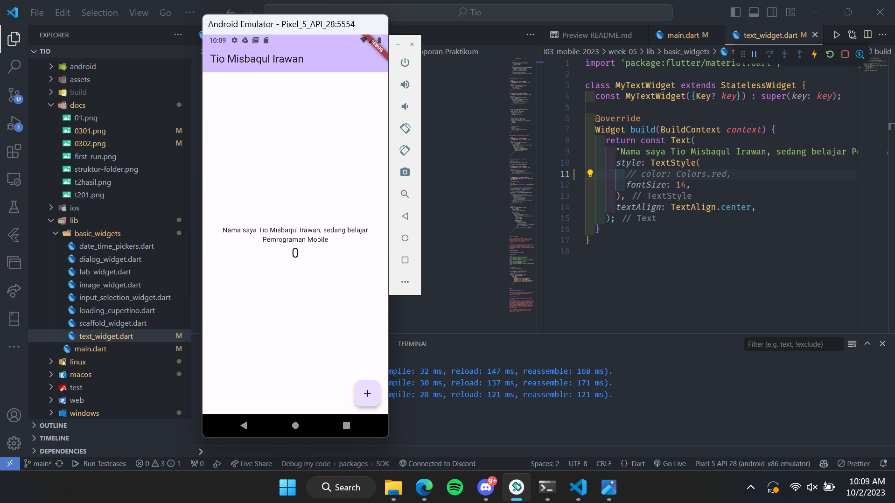

# Laporan Praktikum

<table>
  <tr>
    <th>Nama</th>
    <td>Tio Misbaqul Irawan</td>
  </tr>
  <tr>
    <th>NIM</th>
    <td>2141720003</td>
  </tr>
  <tr>
    <th>Proyek</th>
    <td>Mobile</td>
  </tr>
</table>

## Daftar Isi

- [Laporan Praktikum](#laporan-praktikum)
  - [Daftar Isi](#daftar-isi)
  - [Praktikum 1](#praktikum-1)
  - [Praktikum 2](#praktikum-2)
    - [Langkah 11](#langkah-11)
    - [Langkah 12](#langkah-12)
  - [Praktikum 3](#praktikum-3)
    - [Langkah 1: Text Widget](#langkah-1-text-widget)
    - [Langkah 2: Image Widget](#langkah-2-image-widget)
  - [Praktikum 4](#praktikum-4)
    - [Langkah 1: Cupertino Button dan Loading Bar](#langkah-1-cupertino-button-dan-loading-bar)
    - [Langkah 2: Floating Action Button (FAB)](#langkah-2-floating-action-button-fab)
    - [Langkah 3: Scaffold Widget](#langkah-3-scaffold-widget)
    - [Langkah 4: Dialog Widget](#langkah-4-dialog-widget)
    - [Langkah 5: Input dan Selection Widget](#langkah-5-input-dan-selection-widget)
    - [Langkah 6: Date and Time Pickers](#langkah-6-date-and-time-pickers)
  - [Tugas Praktikum](#tugas-praktikum)
      - [1.  Selesaikan Praktikum 1 sampai 4, lalu dokumentasikan dan push ke repository Anda berupa screenshot setiap hasil pekerjaan beserta penjelasannya di file README.md!](#1--selesaikan-praktikum-1-sampai-4-lalu-dokumentasikan-dan-push-ke-repository-anda-berupa-screenshot-setiap-hasil-pekerjaan-beserta-penjelasannya-di-file-readmemd)
      - [2. Pada praktikum 4 mulai dari Langkah 3 sampai 6, buatlah file widget tersendiri di folder basic\_widgets, kemudian pada file main.dart cukup melakukan import widget sesuai masing-masing langkah tersebut!](#2-pada-praktikum-4-mulai-dari-langkah-3-sampai-6-buatlah-file-widget-tersendiri-di-folder-basic_widgets-kemudian-pada-file-maindart-cukup-melakukan-import-widget-sesuai-masing-masing-langkah-tersebut)
      - [3. Selesaikan Codelabs: Your first Flutter app, lalu buatlah laporan praktikumnya dan push ke repository GitHub Anda!](#3-selesaikan-codelabs-your-first-flutter-app-lalu-buatlah-laporan-praktikumnya-dan-push-ke-repository-github-anda)
      - [4. README.md berisi: capture hasil akhir tiap praktikum (side-by-side, bisa juga berupa file GIF agar terlihat proses perubahan ketika ada aksi dari pengguna) di browser dan perangkat fisik (device) dengan menampilkan NIM dan Nama Anda sebagai ciri pekerjaan Anda. Jika mode developer di perangkat HP Anda belum aktif, silakan cari di internet cara mengaktifkannya!](#4-readmemd-berisi-capture-hasil-akhir-tiap-praktikum-side-by-side-bisa-juga-berupa-file-gif-agar-terlihat-proses-perubahan-ketika-ada-aksi-dari-pengguna-di-browser-dan-perangkat-fisik-device-dengan-menampilkan-nim-dan-nama-anda-sebagai-ciri-pekerjaan-anda-jika-mode-developer-di-perangkat-hp-anda-belum-aktif-silakan-cari-di-internet-cara-mengaktifkannya)
      - [5. Kumpulkan berupa link repository/commit GitHub Anda ke tautan spreadsheet yang telah disepakati oleh dosen!](#5-kumpulkan-berupa-link-repositorycommit-github-anda-ke-tautan-spreadsheet-yang-telah-disepakati-oleh-dosen)

## Praktikum 1

Membuat project flutter

```bash
E:\Project\kuliah\2141720003-mobile-2023>flutter create week05  
Creating project week05...
Resolving dependencies in week05... (4.4s)
Got dependencies in week05.
Wrote 129 files.

All done!
You can find general documentation for Flutter at: https://docs.flutter.dev/
Detailed API documentation is available at: https://api.flutter.dev/
If you prefer video documentation, consider: https://www.youtube.com/c/flutterdev

In order to run your application, type:

  $ cd week05
  $ flutter run

Your application code is in week05\lib\main.dart.


E:\Project\kuliah\2141720003-mobile-2023>mv week05 week-05
```

Saya membuat project dengan nama `week05` kemudian merenamenya menjadi `week-05`. Ini dikarenakan aturan penamaan project flutter yang tidak boleh menggunakan simbol.

Setelah itu akan terbentuk struiktur folder seperti berikut


## Praktikum 2

Dikarenakan project ini sudah saya letakan pada repository github, maka saya lanjutkan ke langkah 11.

### Langkah 11


Pada langkah ini saya menjalankan project flutter yang sudah saya buat sebelumnya. Hasilnya seperti gambar diatas.

### Langkah 12

> Silakan screenshot seperti pada Langkah 11, namun teks yang ditampilkan dalam aplikasi berupa nama lengkap Anda. Simpan file screenshot dengan nama 01.png pada folder images (buat folder baru jika belum ada) di project hello_world Anda. Lalu ubah isi README.md seperti berikut, sehingga tampil hasil screenshot pada file README.md. Kemudian push ke repository Anda.



## Praktikum 3

###  Langkah 1: Text Widget

lib/basic_widgets/text_widget.dart
```dart
import 'package:flutter/material.dart';

class MyTextWidget extends StatelessWidget {
  const MyTextWidget({Key? key}) : super(key: key);

  @override
  Widget build(BuildContext context) {
    return const Text(
      "Nama saya Tio Misbaqul Irawan, sedang belajar Pemrograman Mobile",
      style: TextStyle(
        color: Colors.red,
        fontSize: 14,
      ),
      textAlign: TextAlign.center,
    );
  }
}
```

Hasil


### Langkah 2: Image Widget

lib/basic_widgets/image_widget.dart

```dart
import 'package:flutter/material.dart';

class MyImageWidget extends StatelessWidget {
  const MyImageWidget({Key? key}) : super(key: key);

  @override
  Widget build(BuildContext context) {
    return const Image(image: AssetImage("assets/polinema_logo.png"));
  }
}
```

Hasil


## Praktikum 4

### Langkah 1: Cupertino Button dan Loading Bar

lib/basic_widgets/loading_cupertino.dart

```dart
import 'package:flutter/cupertino.dart';
import 'package:flutter/material.dart';

class MyLoadingCupertino extends StatelessWidget {
  const MyLoadingCupertino({super.key});

  @override
  Widget build(BuildContext context) {
    return MaterialApp(
      home: Container(
        margin: const EdgeInsets.only(top: 30),
        color: Colors.white,
        child: Column(
          children: <Widget>[
            CupertinoButton(
              child: const Text("Contoh button"),
              onPressed: () {},
            ),
            const CupertinoActivityIndicator(),
          ],
        ),
      ),
    );
  }
}
```

### Langkah 2: Floating Action Button (FAB)

lib/basic_widgets/fab_widget.dart

```dart
import 'package:flutter/material.dart';

class MyFabWidget extends StatelessWidget {
  const MyFabWidget({super.key});

  @override
  Widget build(BuildContext context) {
    return MaterialApp(
      home: Scaffold(
        floatingActionButton: FloatingActionButton(
          onPressed: () {
            // Add your onPressed code here!
          },
          backgroundColor: Colors.pink,
          child: const Icon(Icons.thumb_up),
        ),
      ),
    );
  }
}
```

### Langkah 3: Scaffold Widget

```dart
import 'package:flutter/material.dart';

void main() {
  runApp(const MyApp());
}

class MyApp extends StatelessWidget {
  const MyApp({Key? key}) : super(key: key);

  // This widget is the root of your application.
  @override
  Widget build(BuildContext context) {
    return MaterialApp(
      title: 'Flutter Demo',
      theme: ThemeData(
        primarySwatch: Colors.red,
      ),
      home: const MyHomePage(title: 'My Increment App'),
    );
  }
}

class MyHomePage extends StatefulWidget {
  const MyHomePage({Key? key, required this.title}) : super(key: key);

  final String title;

  @override
  State<MyHomePage> createState() => _MyHomePageState();
}

class _MyHomePageState extends State<MyHomePage> {
  int _counter = 0;

  void _incrementCounter() {
    setState(() {
      _counter++;
    });
  }

  @override
  Widget build(BuildContext context) {
    return Scaffold(
      appBar: AppBar(
        title: Text(widget.title),
      ),
      body: Center(
        child: Column(
          mainAxisAlignment: MainAxisAlignment.center,
          children: <Widget>[
            const Text(
              'You have pushed the button this many times:',
            ),
            Text(
              '$_counter',
              style: Theme.of(context).textTheme.headline4,
            ),
          ],
        ),
      ),
      bottomNavigationBar: BottomAppBar(
        child: Container(
          height: 50.0,
        ),
      ),
      floatingActionButton: FloatingActionButton(
        onPressed: _incrementCounter,
        tooltip: 'Increment Counter',
        child: const Icon(Icons.add),
      ), 
      floatingActionButtonLocation: FloatingActionButtonLocation.centerDocked,
    );
  }
}
```

### Langkah 4: Dialog Widget

```dart
class MyApp extends StatelessWidget {
  const MyApp({Key? key}) : super(key: key);

  @override
  Widget build(BuildContext context) {
    return const MaterialApp(
      home: Scaffold(
        body: MyLayout(),
      ),
    );
  }
}

class MyLayout extends StatelessWidget {
  const MyLayout({Key? key}) : super(key: key);

  @override
  Widget build(BuildContext context) {
    return Padding(
      padding: const EdgeInsets.all(8.0),
      child: ElevatedButton(
        child: const Text('Show alert'),
        onPressed: () {
          showAlertDialog(context);
        },
      ),
    );
  }
}

showAlertDialog(BuildContext context) {
  // set up the button
  Widget okButton = TextButton(
    child: const Text("OK"),
    onPressed: () {
      Navigator.pop(context);
    },
  );

  // set up the AlertDialog
  AlertDialog alert = AlertDialog(
    title: const Text("My title"),
    content: const Text("This is my message."),
    actions: [
      okButton,
    ],
  );

  // show the dialog
  showDialog(
    context: context,
    builder: (BuildContext context) {
      return alert;
    },
  );
}
```

### Langkah 5: Input dan Selection Widget

```dart
class MyApp extends StatelessWidget {
  const MyApp({Key? key}) : super(key: key);

  @override
  Widget build(BuildContext context) {
    return MaterialApp(
      home: Scaffold(
        appBar: AppBar(title: const Text("Contoh TextField")),
        body: const TextField(
          obscureText: false,
          decoration: InputDecoration(
            border: OutlineInputBorder(),
            labelText: 'Nama',
          ),
        ),
      ),
    );
  }
}
```

### Langkah 6: Date and Time Pickers

```dart
import 'dart:async';
import 'package:flutter/material.dart';

void main() => runApp(const MyApp());

class MyApp extends StatelessWidget {
  const MyApp({Key? key}) : super(key: key);

  @override
  Widget build(BuildContext context) {
    return const MaterialApp(
      title: 'Contoh Date Picker',
      home: MyHomePage(title: 'Contoh Date Picker'),
    );
  }
}

class MyHomePage extends StatefulWidget {
  const MyHomePage({Key? key, required this.title}) : super(key: key);

  final String title;

  @override
  _MyHomePageState createState() => _MyHomePageState();
}

class _MyHomePageState extends State<MyHomePage> {
  // Variable/State untuk mengambil tanggal
  DateTime selectedDate = DateTime.now();

  //  Initial SelectDate FLutter
  Future<void> _selectDate(BuildContext context) async {
    // Initial DateTime FIinal Picked
    final DateTime? picked = await showDatePicker(
        context: context,
        initialDate: selectedDate,
        firstDate: DateTime(2015, 8),
        lastDate: DateTime(2101));
    if (picked != null && picked != selectedDate) {
      setState(() {
        selectedDate = picked;
      });
    }
  }

  @override
  Widget build(BuildContext context) {
    return Scaffold(
      appBar: AppBar(
        title: Text(widget.title),
      ),
      body: Center(
        child: Column(
          mainAxisSize: MainAxisSize.min,
          children: <Widget>[
            Text("${selectedDate.toLocal()}".split(' ')[0]),
            const SizedBox(
              height: 20.0,
            ),
            ElevatedButton(
              onPressed: () => {
                _selectDate(context),
                // ignore: avoid_print
                print(selectedDate.day + selectedDate.month + selectedDate.year)
              },
              child: const Text('Pilih Tanggal'),
            ),
          ],
        ),
      ),
    );
  }
}
```

## Tugas Praktikum

#### 1.  Selesaikan Praktikum 1 sampai 4, lalu dokumentasikan dan push ke repository Anda berupa screenshot setiap hasil pekerjaan beserta penjelasannya di file README.md!

> DONE

#### 2. Pada praktikum 4 mulai dari Langkah 3 sampai 6, buatlah file widget tersendiri di folder basic_widgets, kemudian pada file main.dart cukup melakukan import widget sesuai masing-masing langkah tersebut!

lib/basic_widgets


lib/main.dart

```dart
import 'package:flutter/material.dart';
import 'package:week05/basic_widgets/date_time_pickers.dart';
import 'package:week05/basic_widgets/dialog_widget.dart';
import 'package:week05/basic_widgets/input_selection_widget.dart';
import 'package:week05/basic_widgets/scaffold_widget.dart';


void main() {
  runApp(const TugasNo2());
}

class TugasNo2 extends StatelessWidget {
  const TugasNo2({super.key});

  @override
  Widget build(BuildContext context) {
    return const MaterialApp(
      home: Row(
        children: [
          Expanded(child: MyScaffoldWidget()),
          Expanded(child: MyDialogWidget()),
          Expanded(child: MyInputSelectionWidget()),
          Expanded(child: MyDateTimePickers()),
        ],
      ),
    );
  }
}
```

Hasil


#### 3. Selesaikan Codelabs: Your first Flutter app, lalu buatlah laporan praktikumnya dan push ke repository GitHub Anda!

> Hasil praktikum
> 
> [indmind/namer_app](https://github.com/indmind/namer_app)

#### 4. README.md berisi: capture hasil akhir tiap praktikum (side-by-side, bisa juga berupa file GIF agar terlihat proses perubahan ketika ada aksi dari pengguna) di browser dan perangkat fisik (device) dengan menampilkan NIM dan Nama Anda sebagai ciri pekerjaan Anda. Jika mode developer di perangkat HP Anda belum aktif, silakan cari di internet cara mengaktifkannya!

#### 5. Kumpulkan berupa link repository/commit GitHub Anda ke tautan spreadsheet yang telah disepakati oleh dosen!