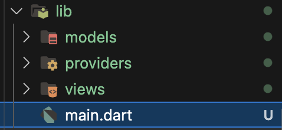
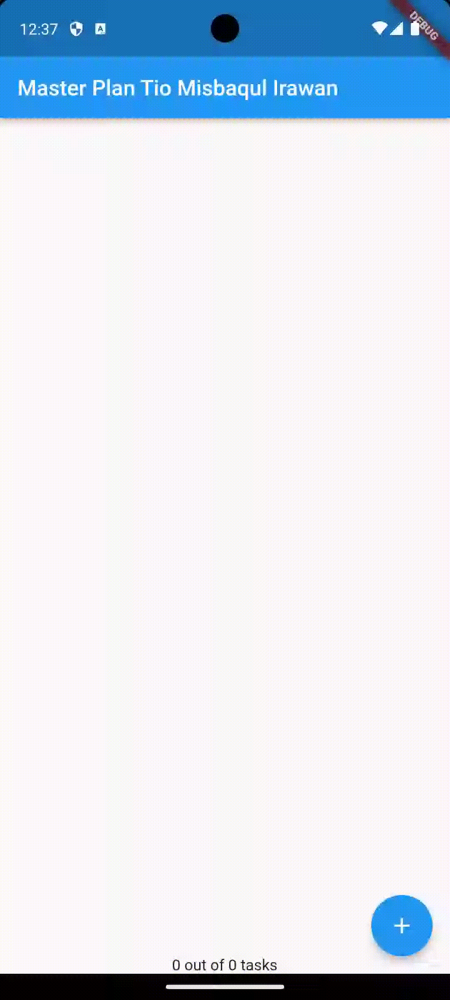
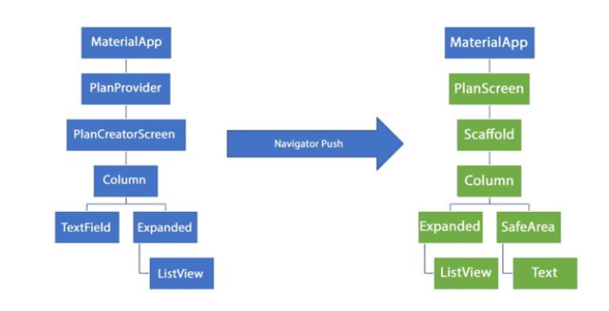

# Laporan Praktikum

<table>
  <tr>
    <th>Nama</th>
    <td>Tio Misbaqul Irawan</td>
  </tr>
  <tr>
    <th>NIM</th>
    <td>2141720003</td>
  </tr>
  <tr>
    <th>Proyek</th>
    <td>Mobile</td>
  </tr>
</table>

- [Laporan Praktikum](#laporan-praktikum)
  - [Praktikum 1 - Dasar State dengan Model-View](#praktikum-1---dasar-state-dengan-model-view)
    - [Langkah 1 - Buat Project Baru](#langkah-1---buat-project-baru)
    - [Langkah 2 - Membuat Model](#langkah-2---membuat-model)
    - [Langkah 3 - Membuat View](#langkah-3---membuat-view)
    - [Langkah 4 - Buat file `data_layer.dart`](#langkah-4---buat-file-data_layerdart)
    - [Langkah 5 - Pindah ke file `main.dart`](#langkah-5---pindah-ke-file-maindart)
    - [Langkah 6 - Buat file `plan_screen.dart`](#langkah-6---buat-file-plan_screendart)
    - [Langkah 7 - buat method `_buildAddTaskButton()`](#langkah-7---buat-method-_buildaddtaskbutton)
    - [Langkah 8 - buat widget `_buildList()`](#langkah-8---buat-widget-_buildlist)
    - [Langkah 9 - buat widget `_buildTaskTile()`](#langkah-9---buat-widget-_buildtasktile)
    - [Langkah 10 - Tambah Scroll Controller](#langkah-10---tambah-scroll-controller)
    - [Langkah 11 - Tambah Scroll Listener](#langkah-11---tambah-scroll-listener)
    - [Langkah 12 - Tambah controller dan keyboard behavior](#langkah-12---tambah-controller-dan-keyboard-behavior)
    - [Langkah 13 - Terakhir, tambah method `dispose()`](#langkah-13---terakhir-tambah-method-dispose)
    - [Langkah 14 - Jalankan Aplikasi](#langkah-14---jalankan-aplikasi)
    - [Tugas](#tugas)
  - [Praktikum 2 - Dasar State dengan Provider](#praktikum-2---dasar-state-dengan-provider)
    - [Langkah 1 - Buat file `plan_provider.dart`](#langkah-1---buat-file-plan_providerdart)
    - [Langkah 2 - Edit `main.dart`](#langkah-2---edit-maindart)
    - [Langkah 3 - Tambah method pada model `plan.dart`](#langkah-3---tambah-method-pada-model-plandart)
    - [Langkah 4 - Pindah ke PlanScreen](#langkah-4---pindah-ke-planscreen)
    - [Langkah 5: Edit method `_buildAddTaskButton`](#langkah-5-edit-method-_buildaddtaskbutton)
    - [Langkah 6 - Edit method `_buildTaskTile`](#langkah-6---edit-method-_buildtasktile)
    - [Langkah 7 - Edit method `_buildList`](#langkah-7---edit-method-_buildlist)
    - [Langkah 8 - Tetap di class PlanScreen](#langkah-8---tetap-di-class-planscreen)
    - [Langkah 9 - Tambah widget SafeArea](#langkah-9---tambah-widget-safearea)
    - [Langkah 10 - Jalankan Aplikasi](#langkah-10---jalankan-aplikasi)
    - [Tugas](#tugas-1)
  - [Praktikum 3 - Membuat State di Multiple Screens](#praktikum-3---membuat-state-di-multiple-screens)
    - [Langkah 1 - Edit `PlanProvider`](#langkah-1---edit-planprovider)
    - [Langkah 2 - Edit `main.dart`](#langkah-2---edit-maindart-1)
    - [Langkah 3 - Edit `plan_screen.dart`](#langkah-3---edit-plan_screendart)
    - [Langkah 4 - Error](#langkah-4---error)
    - [Langkah 5 - Tambah `getter Plan`](#langkah-5---tambah-getter-plan)
    - [Langkah 6 - Method `initState()`](#langkah-6---method-initstate)
    - [Langkah 7 - Widget `build`](#langkah-7---widget-build)
    - [Langkah 8 - Edit `_buildTaskTile`](#langkah-8---edit-_buildtasktile)
    - [Langkah 9 - Buat screen baru](#langkah-9---buat-screen-baru)
    - [Langkah 10 - Pindah ke class `_PlanCreatorScreenState`](#langkah-10---pindah-ke-class-_plancreatorscreenstate)
    - [Langkah 11 - Pindah ke method build](#langkah-11---pindah-ke-method-build)
    - [Langkah 13 - Buat void `addPlan()`](#langkah-13---buat-void-addplan)
    - [Langkah 14 - Buat widget `_buildMasterPlans()`](#langkah-14---buat-widget-_buildmasterplans)
    - [Langkah 15 - Jalankan Aplikasi](#langkah-15---jalankan-aplikasi)
    - [Tugas](#tugas-2)


## Praktikum 1 - Dasar State dengan Model-View

### Langkah 1 - Buat Project Baru

Membuat susunan folder dalam project



### Langkah 2 - Membuat Model

Praktik terbaik untuk memulai adalah pada lapisan data (data layer). Ini akan memberi Anda gambaran yang jelas tentang aplikasi Anda, tanpa masuk ke detail antarmuka pengguna Anda. Di folder model, buat file bernama task.dart dan buat class Task. Class ini memiliki atribut description dengan tipe data String dan complete dengan tipe data Boolean, serta ada konstruktor. Kelas ini akan menyimpan data tugas untuk aplikasi kita. Tambahkan kode berikut:

```dart
class Task {
  final String description;
  final bool complete;

  const Task({
    this.complete = false,
    this.description = '',
  });
}
```

### Langkah 3 - Membuat View

Kita juga perlu sebuah List untuk menyimpan daftar rencana dalam aplikasi to-do ini. Buat file plan.dart di dalam folder models dan isi kode seperti berikut.

```dart
import './task.dart';

class Plan {
  final String name;
  final List<Task> tasks;
  
  const Plan({this.name = '', this.tasks = const []});
}
```

### Langkah 4 - Buat file `data_layer.dart`

Kita dapat membungkus beberapa data layer ke dalam sebuah file yang nanti akan mengekspor kedua model tersebut. Dengan begitu, proses impor akan lebih ringkas seiring berkembangnya aplikasi. Buat file bernama data_layer.dart di folder models. Kodenya hanya berisi export seperti berikut.

```dart
export 'plan.dart';
export 'task.dart';
```

### Langkah 5 - Pindah ke file `main.dart`

```dart
import 'package:flutter/material.dart';
import './views/plan_screen.dart';

void main() => runApp(MasterPlanApp());

class MasterPlanApp extends StatelessWidget {
  const MasterPlanApp({super.key});

  @override
  Widget build(BuildContext context) {
    return MaterialApp(
     theme: ThemeData(primarySwatch: Colors.purple),
     home: PlanScreen(),
    );
  }
}
```

### Langkah 6 - Buat file `plan_screen.dart`

```dart
import '../models/data_layer.dart';
import 'package:flutter/material.dart';

class PlanScreen extends StatefulWidget {
  const PlanScreen({super.key});

  @override
  State createState() => _PlanScreenState();
}

class _PlanScreenState extends State<PlanScreen> {
  Plan plan = const Plan();

  @override
  Widget build(BuildContext context) {
   return Scaffold(
    // ganti ‘Namaku' dengan Nama panggilan Anda
    appBar: AppBar(title: const Text('Master Plan Namaku')),
    body: _buildList(),
    floatingActionButton: _buildAddTaskButton(),
   );
  }
}
```

### Langkah 7 - buat method `_buildAddTaskButton()`

```dart
Widget _buildAddTaskButton() {
  return FloatingActionButton(
   child: const Icon(Icons.add),
   onPressed: () {
     setState(() {
      plan = Plan(
       name: plan.name,
       tasks: List<Task>.from(plan.tasks)
       ..add(const Task()),
     );
    });
   },
  );
}
```

### Langkah 8 - buat widget `_buildList()`

```dart
Widget _buildList() {
  return ListView.builder(
   itemCount: plan.tasks.length,
   itemBuilder: (context, index) =>
   _buildTaskTile(plan.tasks[index], index),
  );
}
```

### Langkah 9 - buat widget `_buildTaskTile()`

```dart
Widget _buildTaskTile(Task task, int index) {
    return ListTile(
      leading: Checkbox(
          value: task.complete,
          onChanged: (selected) {
            setState(() {
              plan = Plan(
                name: plan.name,
                tasks: List<Task>.from(plan.tasks)
                  ..[index] = Task(
                    description: task.description,
                    complete: selected ?? false,
                  ),
              );
            });
          }),
      title: TextFormField(
        initialValue: task.description,
        onChanged: (text) {
          setState(() {
            plan = Plan(
              name: plan.name,
              tasks: List<Task>.from(plan.tasks)
                ..[index] = Task(
                  description: text,
                  complete: task.complete,
                ),
            );
          });
        },
      ),
    );
  }
```

### Langkah 10 - Tambah Scroll Controller

```dart
late ScrollController scrollController;
```

### Langkah 11 - Tambah Scroll Listener

```dart
@override
void initState() {
  super.initState();
  scrollController = ScrollController()
    ..addListener(() {
      FocusScope.of(context).requestFocus(FocusNode());
    });
}
```

### Langkah 12 - Tambah controller dan keyboard behavior

```dart
return ListView.builder(
  controller: scrollController,
 keyboardDismissBehavior: Theme.of(context).platform ==
 TargetPlatform.iOS
          ? ScrollViewKeyboardDismissBehavior.onDrag
          : ScrollViewKeyboardDismissBehavior.manual,
)
```

### Langkah 13 - Terakhir, tambah method `dispose()`

```dart
@override
void dispose() {
  scrollController.dispose();
  super.dispose();
}
```

### Langkah 14 - Jalankan Aplikasi



### Tugas

1. Jelaskan maksud dari langkah 4 pada praktikum tersebut!

    Langkah 4 pada praktikum tersebut adalah untuk membuat file data_layer.dart yang berisi export dari plan.dart dan task.dart. Hal tersebut dilakukan agar meringkas proses import pada kedua file model tersebut.

2. Mengapa perlu variabel plan di langkah 6 pada praktikum tersebut? Mengapa dibuat konstanta ?

    Variabel plan pada langkah 6 pada praktikum tersebut digunakan untuk menyimpan data rencana yang akan ditampilkan. Variabel tersebut dibuat konstanta agar data yang disimpan tidak dapat diubah.

3. Lakukan capture hasil dari Langkah 9 berupa GIF, kemudian jelaskan apa yang telah Anda buat!
    
    Function widget tersebut dibuat untuk membuat widget tile yang berisikan rencana dari user yang akan ditampilkan. Widget tersebut berisikan checkbox dan textfield yang digunakan untuk menampilkan rencana dari user.

4. Apa kegunaan method pada Langkah 11 dan 13 dalam lifecyle state ?

    Method pada langkah 11 digunakan untuk membuat scroll controller yang akan digunakan untuk mengatur scroll pada aplikasi (init state). Sedangkan method pada langkah 13 digunakan untuk menghancurkan scroll controller yang telah dibuat. Hal ini berguna agar tidak terjadi memory leak pada aplikasi.

## Praktikum 2 - Dasar State dengan Provider

### Langkah 1 - Buat file `plan_provider.dart`

```dart
import 'package:flutter/material.dart';
import '../models/data_layer.dart';

class PlanProvider extends InheritedNotifier<ValueNotifier<Plan>> {
  const PlanProvider({super.key, required Widget child, required
   ValueNotifier<Plan> notifier})
  : super(child: child, notifier: notifier);

  static ValueNotifier<Plan> of(BuildContext context) {
   return context.
    dependOnInheritedWidgetOfExactType<PlanProvider>()!.notifier!;
  }
}
```

### Langkah 2 - Edit `main.dart`

```dart
return MaterialApp(
  theme: ThemeData(primarySwatch: Colors.purple),
  home: PlanProvider(
    notifier: ValueNotifier<Plan>(const Plan()),
    child: const PlanScreen(),
   ),
);
```

### Langkah 3 - Tambah method pada model `plan.dart`

```dart
int get completedCount => tasks
  .where((task) => task.complete)
  .length;

String get completenessMessage =>
  '$completedCount out of ${tasks.length} tasks';
```

### Langkah 4 - Pindah ke PlanScreen

### Langkah 5: Edit method `_buildAddTaskButton`

```dart
Widget _buildAddTaskButton(BuildContext context) {
  ValueNotifier<Plan> planNotifier = PlanProvider.of(context);
  return FloatingActionButton(
    child: const Icon(Icons.add),
    onPressed: () {
      Plan currentPlan = planNotifier.value;
      planNotifier.value = Plan(
        name: currentPlan.name,
        tasks: List<Task>.from(currentPlan.tasks)..add(const Task()),
      );
    },
  );
}
```

### Langkah 6 - Edit method `_buildTaskTile`

```dart
Widget _buildTaskTile(Task task, int index, BuildContext context) {
  ValueNotifier<Plan> planNotifier = PlanProvider.of(context);
  return ListTile(
    leading: Checkbox(
       value: task.complete,
       onChanged: (selected) {
         Plan currentPlan = planNotifier.value;
         planNotifier.value = Plan(
           name: currentPlan.name,
           tasks: List<Task>.from(currentPlan.tasks)
             ..[index] = Task(
               description: task.description,
               complete: selected ?? false,
             ),
         );
       }),
    title: TextFormField(
      initialValue: task.description,
      onChanged: (text) {
        Plan currentPlan = planNotifier.value;
        planNotifier.value = Plan(
          name: currentPlan.name,
          tasks: List<Task>.from(currentPlan.tasks)
            ..[index] = Task(
              description: text,
              complete: task.complete,
            ),
        );
      },
    ),
  );
}
```

### Langkah 7 - Edit method `_buildList`

```dart
Widget _buildList(Plan plan) {
   return ListView.builder(
     controller: scrollController,
     itemCount: plan.tasks.length,
     itemBuilder: (context, index) =>
        _buildTaskTile(plan.tasks[index], index, context),
   );
}
```

### Langkah 8 - Tetap di class PlanScreen

### Langkah 9 - Tambah widget SafeArea

```dart

@override
Widget build(BuildContext context) {
   return Scaffold(
     appBar: AppBar(title: const Text('Master Plan')),
     body: ValueListenableBuilder<Plan>(
       valueListenable: PlanProvider.of(context),
       builder: (context, plan, child) {
         return Column(
           children: [
             Expanded(child: _buildList(plan)),
             SafeArea(child: Text(plan.completenessMessage))
           ],
         );
       },
     ),
     floatingActionButton: _buildAddTaskButton(context),
   );
}
```

### Langkah 10 - Jalankan Aplikasi


### Tugas

1. Jelaskan mana yang dimaksud `InheritedWidget` pada langkah 1 tersebut! Mengapa yang digunakan `InheritedNotifier`?

    InheritedWidget pada langkah 1 digunakan untuk mentransmisikan data dari widget induk ke widget anak dalam pohon widget. Namun, dalam kasus ini, InheritedNotifier digunakan karena InheritedWidget tidak memiliki metode langsung untuk mengakses data dari notifier.

2. Jelaskan maksud dari method di langkah 3 pada praktikum tersebut! Mengapa dilakukan demikian?

    Method pada langkah 3 digunakan untuk menghitung jumlah tugas yang telah diselesaikan dalam rencana. Hal ini dilakukan agar pesan yang menunjukkan jumlah tugas yang telah diselesaikan dapat ditampilkan kepada pengguna.

3. Lakukan capture hasil dari Langkah 9 berupa GIF, kemudian jelaskan apa yang telah Anda buat!

    Langkah tersebut bertujuan untuk menambahkan widget yang akan menampilkan rencana yang ada serta menampilkan informasi tentang tugas yang telah diselesaikan dalam rencana. Widget tersebut ditambahkan ke dalam body aplikasi untuk memastikan tampilan yang sesuai dan informatif kepada pengguna.

## Praktikum 3 - Membuat State di Multiple Screens

### Langkah 1 - Edit `PlanProvider`

```dart
class PlanProvider extends
InheritedNotifier<ValueNotifier<List<Plan>>> {
  const PlanProvider({super.key, required Widget child, required
ValueNotifier<List<Plan>> notifier})
     : super(child: child, notifier: notifier);

  static ValueNotifier<List<Plan>> of(BuildContext context) {
    return context.
dependOnInheritedWidgetOfExactType<PlanProvider>()!.notifier!;
  }
}
```

### Langkah 2 - Edit `main.dart`

```dart
@override
Widget build(BuildContext context) {
  return PlanProvider(
    notifier: ValueNotifier<List<Plan>>(const []),
    child: MaterialApp(
      title: 'State management app',
      theme: ThemeData(
        primarySwatch: Colors.blue,
      ),
      home: const PlanScreen(),
    ),
  );
}
```

### Langkah 3 - Edit `plan_screen.dart`

```dart
final Plan plan;
const PlanScreen({super.key, required this.plan});
```

### Langkah 4 - Error

### Langkah 5 - Tambah `getter Plan`

```dart
class _PlanScreenState extends State<PlanScreen> {
  late ScrollController scrollController;
  Plan get plan => widget.plan;
}
```

### Langkah 6 - Method `initState()`

```dart
@override
void initState() {
   super.initState();
   scrollController = ScrollController()
    ..addListener(() {
      FocusScope.of(context).requestFocus(FocusNode());
    });


}
```

### Langkah 7 - Widget `build`

```dart
@override
  Widget build(BuildContext context) {
    ValueNotifier<List<Plan>> plansNotifier = PlanProvider.of(context);

    return Scaffold(
      appBar: AppBar(title: Text(_plan.name)),
      body: ValueListenableBuilder<List<Plan>>(
        valueListenable: plansNotifier,
        builder: (context, plans, child) {
          Plan currentPlan = plans.firstWhere((p) => p.name == plan.
name);
          return Column(
            children: [
              Expanded(child: _buildList(currentPlan)),
              SafeArea(child: Text(currentPlan.
completenessMessage)),
            ],);},),
      floatingActionButton: _buildAddTaskButton(context,)
  ,);
 }

  Widget _buildAddTaskButton(BuildContext context) {
    ValueNotifier<List<Plan>> planNotifier = PlanProvider.
of(context);
    return FloatingActionButton(
      child: const Icon(Icons.add),
      onPressed: () {
        Plan currentPlan = plan;
        int planIndex =
            planNotifier.value.indexWhere((p) => p.name == currentPlan.name);
        List<Task> updatedTasks = List<Task>.from(currentPlan.tasks)
          ..add(const Task());
        planNotifier.value = List<Plan>.from(planNotifier.value)
          ..[planIndex] = Plan(
            name: currentPlan.name,
            tasks: updatedTasks,
          );
        plan = Plan(
          name: currentPlan.name,
          tasks: updatedTasks,
        );},);
  }
  ```

### Langkah 8 - Edit `_buildTaskTile`

```dart
Widget _buildTaskTile(Task task, int index, BuildContext context)
{
    ValueNotifier<List<Plan>> planNotifier = PlanProvider.
of(context);

    return ListTile(
      leading: Checkbox(
         value: task.complete,
         onChanged: (selected) {
           Plan currentPlan = plan;
           int planIndex = planNotifier.value
              .indexWhere((p) => p.name == currentPlan.name);
           planNotifier.value = List<Plan>.from(planNotifier.value)
             ..[planIndex] = Plan(
               name: currentPlan.name,
               tasks: List<Task>.from(currentPlan.tasks)
                 ..[index] = Task(
                   description: task.description,
                   complete: selected ?? false,
                 ),);
         }),
      title: TextFormField(
        initialValue: task.description,
        onChanged: (text) {
          Plan currentPlan = plan;
          int planIndex =
             planNotifier.value.indexWhere((p) => p.name ==
currentPlan.name);
          planNotifier.value = List<Plan>.from(planNotifier.value)
            ..[planIndex] = Plan(
              name: currentPlan.name,
              tasks: List<Task>.from(currentPlan.tasks)
                ..[index] = Task(
                  description: text,
                  complete: task.complete,
                ),
            );
},),);}

```

### Langkah 9 - Buat screen baru

Gantilah di main.dart pada atribut home menjadi seperti berikut.
```dart
home: const PlanCreatorScreen(),
```

### Langkah 10 - Pindah ke class `_PlanCreatorScreenState`

```dart
final textController = TextEditingController();

@override
void dispose() {
  textController.dispose();
  super.dispose();
}
```

### Langkah 11 - Pindah ke method build

```dart

@override
Widget build(BuildContext context) {
  return Scaffold(
    // ganti ‘Namaku' dengan nama panggilan Anda
    appBar: AppBar(title: const Text('Master Plans Namaku')),
    body: Column(children: [
      _buildListCreator(),
      Expanded(child: _buildMasterPlans())
    ]),
  );
}
```

Langkah 12: Buat widget `_buildListCreator`

```dart
Widget _buildListCreator() {
  return Padding(
     padding: const EdgeInsets.all(20.0),
     child: Material(
       color: Theme.of(context).cardColor,
       elevation: 10,
       child: TextField(
          controller: textController,
          decoration: const InputDecoration(
             labelText: 'Add a plan',
             contentPadding: EdgeInsets.all(20)),
          onEditingComplete: addPlan),
     ));
}
```

### Langkah 13 - Buat void `addPlan()`

```dart
void addPlan() {
  final text = textController.text;
    if (text.isEmpty) {
      return;
    }
    final plan = Plan(name: text, tasks: []);
    ValueNotifier<List<Plan>> planNotifier =
PlanProvider.of(context);
    planNotifier.value = List<Plan>.from(planNotifier.value)..
add(plan);
    textController.clear();
    FocusScope.of(context).requestFocus(FocusNode());
    setState(() {});
}
```

### Langkah 14 - Buat widget `_buildMasterPlans()`

```dart
Widget _buildMasterPlans() {
  ValueNotifier<List<Plan>> planNotifier = PlanProvider.of(context);
    List<Plan> plans = planNotifier.value;

    if (plans.isEmpty) {
      return Column(
         mainAxisAlignment: MainAxisAlignment.center,
         children: <Widget>[
           const Icon(Icons.note, size: 100, color: Colors.grey),
           Text('Anda belum memiliki rencana apapun.',
              style: Theme.of(context).textTheme.headlineSmall)
         ]);
    }
    return ListView.builder(
        itemCount: plans.length,
        itemBuilder: (context, index) {
          final plan = plans[index];
          return ListTile(
              title: Text(plan.name),
              subtitle: Text(plan.completenessMessage),
              onTap: () {
                Navigator.of(context).push(
                   MaterialPageRoute(builder: (_) =>
PlanScreen(plan: plan,)));
              });
        });
}
```

### Langkah 15 - Jalankan Aplikasi


### Tugas

1. Berdasarkan Praktikum 3 yang telah Anda lakukan, jelaskan maksud dari gambar diagram berikut ini!



    Diagram yang diberikan menggambarkan struktur aplikasi. Terdapat dua layar (screen) yang dapat diakses oleh pengguna. Layar pertama digunakan untuk menambahkan rencana baru, sementara layar kedua digunakan untuk menampilkan rencana yang telah dibuat oleh pengguna sebelumnya. Diagram juga mencantumkan adanya PlanProvider yang berperan dalam mengakses data dari widget induk ke widget anak. Data yang diakses adalah daftar rencana yang telah dibuat oleh pengguna.

1. Lakukan capture hasil dari Langkah 14 berupa GIF, kemudian jelaskan apa yang telah Anda buat!

    Dalam Langkah 14, tindakan yang dilakukan adalah menambahkan widget yang akan menampilkan daftar rencana yang telah dibuat oleh pengguna. Widget ini ditempatkan dalam bagian body dari aplikasi. Selain itu, tindakan onTap ditambahkan untuk setiap rencana dalam daftar sehingga ketika pengguna mengklik salah satu rencana, aplikasi akan membuka layar PlanScreen yang menampilkan detail dari rencana tersebut.

    