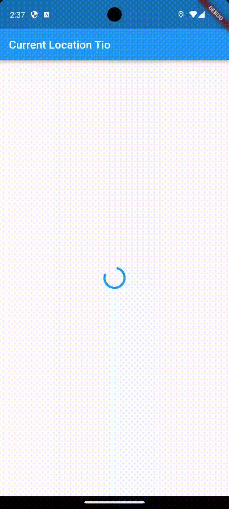

# Laporan Praktikum

<table>
  <tr>
    <th>Nama</th>
    <td>Tio Misbaqul Irawan</td>
  </tr>
  <tr>
    <th>NIM</th>
    <td>2141720003</td>
  </tr>
  <tr>
    <th>Proyek</th>
    <td>Mobile</td>
  </tr>
</table>

## Praktikum 1

### Soal 1
Tambahkan nama panggilan Anda pada title app sebagai identitas hasil pekerjaan Anda.

```dart
appBar: AppBar(
        title: const Text('Back from the Future Tio'),
      ),
```

### Soal 2
Carilah judul buku favorit Anda di Google Books, lalu ganti ID buku pada variabel path di kode tersebut. Caranya ambil di URL browser Anda seperti gambar berikut ini.
 
Kemudian cobalah akses di browser URI tersebut dengan lengkap seperti ini. Jika menampilkan data JSON, maka Anda telah berhasil. Lakukan capture milik Anda dan tulis di README pada laporan praktikum. Lalu lakukan commit dengan pesan "W12: Soal 2".

```dart
Future<Response> getData() async {
  const authority = 'www.googleapis.com';
  const path = '/books/v1/volumes/LDVAEAAAQBAJ';
  Uri url = Uri.https(authority, path);
  return await http.get(url);
}
```

### Soal 3
Jelaskan maksud kode langkah 5 tersebut terkait substring dan catchError!
Capture hasil praktikum Anda berupa GIF dan lampirkan di README. Lalu lakukan commit dengan pesan "W12: Soal 3".

`substring(0, 450)` berfungsi untuk mengambil karakter dari index ke 0 sampai ke index ke 449. `catchError` berfungsi untuk menangkap error yang terjadi pada future yang dijalankan.


## Praktikum 2

### Soal 4
Jelaskan maksud kode langkah 1 dan 2 tersebut!
Capture hasil praktikum Anda berupa GIF dan lampirkan di README. Lalu lakukan commit dengan pesan "W12: Soal 4".

Kode tersebut berfungsi untuk mendefinisikan fungsi yang akan dijalankan secara asynchronous. `returnOneAsync` akan mengembalikan nilai 1 setelah 3 detik, `returnTwoAsync` akan mengembalikan nilai 2 setelah 3 detik, dan `returnThreeAsync` akan mengembalikan nilai 3 setelah 3 detik.

Sedangkan `count()` berfungsi untuk menjumlahkan nilai yang dikembalikan oleh fungsi `returnOneAsync`, `returnTwoAsync`, dan `returnThreeAsync` dan mengubah nilai dari variabel `result` menjadi hasil penjumlahan tersebut.


## Praktikum 3

### Soal 5
Jelaskan maksud kode langkah 2 tersebut!
Capture hasil praktikum Anda berupa GIF dan lampirkan di README. Lalu lakukan commit dengan pesan "W12: Soal 5".


### Soal 6
Jelaskan maksud perbedaan kode langkah 2 dengan langkah 5-6 tersebut!
Capture hasil praktikum Anda berupa GIF dan lampirkan di README. Lalu lakukan commit dengan pesan "W12: Soal 6".

Maksud kode tersebut adalah untuk menampilkan hasil dari fungsi `getNumber()` yang akan mengembalikan nilai 1 setelah 3 detik. Jika fungsi tersebut mengembalikan nilai, maka nilai tersebut akan ditampilkan pada variabel `result`. Jika fungsi tersebut mengembalikan error, maka variabel `result` akan diubah menjadi 'An error occurred'.


## Praktikum 4

### Soal 7
Capture hasil praktikum Anda berupa GIF dan lampirkan di README. Lalu lakukan commit dengan pesan "W12: Soal 7".


### Soal 8
Jelaskan maksud perbedaan kode langkah 1 dan 4!

Perbedaan dari FutureGroup dan Future.wait hanyalah penggunaan FutureGroup membutuhkan package `package:async` sedangkan Future.wait menggunakan package `dart:async`. Namun secara fungsionalitas sama.


## Praktikum 5

### Soal 9
Capture hasil praktikum Anda berupa GIF dan lampirkan di README. Lalu lakukan commit dengan pesan "W12: Soal 9".


### Soal 10
Panggil method handleError() tersebut di ElevatedButton, lalu run. Apa hasilnya? Jelaskan perbedaan kode langkah 1 dan 4!


Perbedaannya adalah syntax yang digunakan. Pada langkah 1, syntax yang digunakan adalah method chaining mulai dari .then().catchError() hingga .whenComplete(). Sedangkan pada langkah 4, syntax yang digunakan adalah method try-catch. Namun secara fungsionalitas sama.

## Praktikum 6

### Soal 11
Tambahkan nama panggilan Anda pada tiap properti title sebagai identitas pekerjaan Anda.

```dart
appBar: AppBar(
  title: const Text('Current Location Tio'),
),
```

### Soal 12
Jika Anda tidak melihat animasi loading tampil, kemungkinan itu berjalan sangat cepat. Tambahkan delay pada method getPosition() dengan kode await Future.delayed(const Duration(seconds: 3));
Apakah Anda mendapatkan koordinat GPS ketika run di browser? Mengapa demikian?
Capture hasil praktikum Anda berupa GIF dan lampirkan di README. Lalu lakukan commit dengan pesan "W12: Soal 12".



### Soal 13
Apakah ada perbedaan UI dengan praktikum sebelumnya? Mengapa demikian?
Capture hasil praktikum Anda berupa GIF dan lampirkan di README. Lalu lakukan commit dengan pesan "W12: Soal 13".
Seperti yang Anda lihat, menggunakan FutureBuilder lebih efisien, clean, dan reactive dengan Future bersama UI.


### Soal 14
Apakah ada perbedaan UI dengan langkah sebelumnya? Mengapa demikian?
Capture hasil praktikum Anda berupa GIF dan lampirkan di README. Lalu lakukan commit dengan pesan "W12: Soal 14".


Tidak ada perbedaan karena tidak terjadi error.

## Praktikum 7

### Soal 15
Tambahkan nama panggilan Anda pada tiap properti title sebagai identitas pekerjaan Anda.
Silakan ganti dengan warna tema favorit Anda.

```dart
return Scaffold(
  backgroundColor: color,
  appBar: AppBar(
    title: const Text("Navigate first screen Tio"),
  ),
  body: Center(
    child: ElevatedButton(
      child: const Text("Change Color"),
      onPressed: () {
        _navigateAndGetColor(context);
      },
    ),
  ),
);
```

### Soal 16
Cobalah klik setiap button, apa yang terjadi ? Mengapa demikian ?
Gantilah 3 warna pada langkah 5 dengan warna favorit Anda!
Capture hasil praktikum Anda berupa GIF dan lampirkan di README. Lalu lakukan commit dengan pesan "W12: Soal 16".


Ketika tombol ditekan, maka akan mengarahkan ke halaman NavigationSecond yang dimana pada halaman tersebut terdapat beberapa button yang ketika ditekan maka akan mengembalikan halaman ke halaman NavigationFirst dengan mengirimkan data berupa warna yang dipilih.
